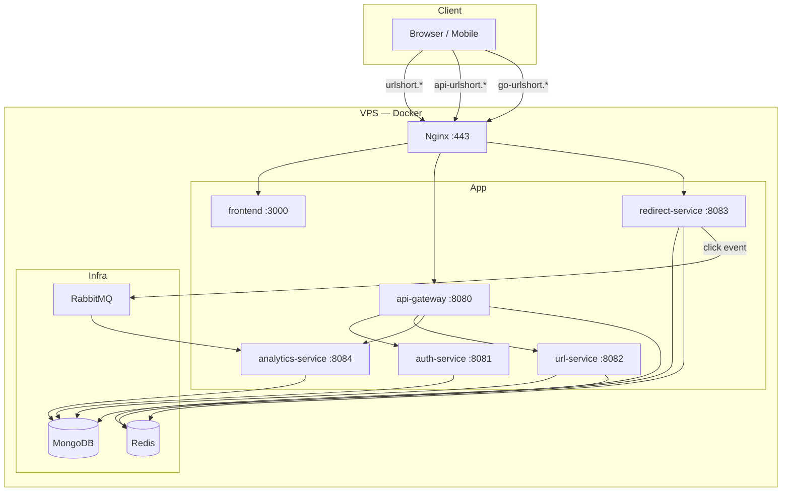

# Kiến trúc & Cấu trúc Dự án — URL Shortener Backend

Tài liệu mô tả **toàn bộ kiến trúc hệ thống**, từng công nghệ dùng để làm gì, và các thành phần cụ thể trong codebase.

**Repo frontend:** [url-shortener-fe](https://github.com/toannguyenit/url-shortener-fe) — xem thêm [ARCHITECTURE.md](https://github.com/toannguyenit/url-shortener-fe/blob/main/ARCHITECTURE.md) phần UI.

**Deploy production:** [DEPLOY.md](./DEPLOY.md) | **Chạy local:** [STARTUP.md](./STARTUP.md)

---

## Mục lục

1. [Tổng quan hệ thống](#1-tổng-quan-hệ-thống)
2. [Luồng nghiệp vụ chính](#2-luồng-nghiệp-vụ-chính)
3. [Cấu trúc Maven modules](#3-cấu-trúc-maven-modules)
4. [Chi tiết từng microservice](#4-chi-tiết-từng-microservice)
5. [Công nghệ & mục đích sử dụng](#5-công-nghệ--mục-đích-sử-dụng)
6. [Cơ sở dữ liệu & cache](#6-cơ-sở-dữ-liệu--cache)
7. [Message queue (RabbitMQ)](#7-message-queue-rabbitmq)
8. [Bảo mật & xác thực](#8-bảo-mật--xác-thực)
9. [API Gateway](#9-api-gateway)
10. [Docker & triển khai](#10-docker--triển-khai)
11. [CI/CD](#11-cicd)
12. [Sơ đồ tổng hợp](#12-sơ-đồ-tổng-hợp)

---

## 1. Tổng quan hệ thống

URL Shortener là hệ thống rút gọn link kiểu Bitly, gồm:

- **Frontend:** Next.js dashboard (repo riêng)
- **Backend:** 5 microservices Spring Boot + 1 API Gateway
- **Hạ tầng:** MongoDB, Redis, RabbitMQ
- **Production:** Docker trên VPS, Nginx reverse proxy, Let's Encrypt SSL

### URL production

| Thành phần | URL |
|------------|-----|
| Dashboard | https://urlshort.toannguyenit.cloud |
| REST API | https://api-urlshort.toannguyenit.cloud |
| Short link | https://go-urlshort.toannguyenit.cloud/{code} |

### Tại sao microservices?

| Lý do | Giải thích |
|-------|------------|
| **Tách redirect** | `redirect-service` xử lý traffic lớn, cần cache Redis, không cần JWT |
| **Tách analytics** | Ghi click bất đồng bộ qua RabbitMQ, không làm chậm redirect |
| **Tách auth** | Quản lý user/token độc lập |
| **Portfolio** | Thể hiện kiến trúc phân tán, message queue, API gateway |

---

## 2. Luồng nghiệp vụ chính

### 2.1 Đăng ký / đăng nhập

```
Browser → Nginx → api-gateway → auth-service → MongoDB (users)
                              ← JWT access + refresh token
```

### 2.2 Tạo short link

```
Browser → gateway (JWT) → url-service → MongoDB (urls)
                                      → trả shortUrl (SHORT_URL_BASE + code)
```

### 2.3 Mở short link (redirect)

```
Browser → Nginx (go-urlshort.*) → redirect-service
    → Redis cache? → hit: dùng cache
    → miss: MongoDB (urls) → ghi Redis
    → RabbitMQ publish click event (async, không chặn redirect)
    → HTTP 302 → longUrl
```

### 2.4 Analytics

```
redirect-service → RabbitMQ (click.events)
                → analytics-service consumer
                → GeoIP lookup → MongoDB (click_events)
                → API /api/analytics/* ← dashboard FE
```

---

## 3. Cấu trúc Maven modules

```
url-shortener-be/
├── pom.xml                 # Parent POM (Java 21, Spring Boot 3.4, Spring Cloud)
├── common/                 # Thư viện dùng chung
├── auth-service/           # :8081
├── url-service/            # :8082
├── redirect-service/       # :8083
├── analytics-service/      # :8084
├── api-gateway/            # :8080
├── deploy/                 # Production Docker Compose, nginx, scripts
├── docker-compose.yml      # Local dev — all-in-one
└── .github/workflows/      # CI/CD
```

### Module `common`

| Thành phần | File | Vai trò |
|------------|------|---------|
| JWT | `JwtService.java` | Tạo/parse access & refresh token (JJWT) |
| DTO message | `ClickEventMessage.java` | Payload click event qua RabbitMQ |
| Exception | `GlobalExceptionHandler.java` | Xử lý lỗi REST thống nhất |
| Util | `Base62.java` | Encode số sang Base62 (legacy; short code giờ random) |

---

## 4. Chi tiết từng microservice

### 4.1 api-gateway (port 8080)

**Vai trò:** Cổng vào duy nhất cho REST API từ frontend.

| Tính năng | File | Chi tiết |
|-----------|------|----------|
| Route | `application.yml` | `/api/auth/**` → auth, `/api/urls/**` → url, `/api/analytics/**` → analytics |
| JWT filter | `JwtAuthFilter.java` | Validate Bearer token; public: register, login, refresh |
| Rate limit | `RateLimitFilter.java` | `POST /api/urls` — 100 req/phút/user (Redis) |
| CORS | `CorsConfig.java` | `CORS_ALLOWED_ORIGINS` từ env |
| Stack | `pom.xml` | Spring Cloud Gateway (reactive), **không** dùng servlet |

### 4.2 auth-service (port 8081)

**Vai trò:** Quản lý người dùng và JWT.

| API | Mô tả |
|-----|-------|
| `POST /api/auth/register` | Tạo user, hash password BCrypt |
| `POST /api/auth/login` | Trả access + refresh token |
| `POST /api/auth/refresh` | Đổi refresh → access mới |
| `GET /api/auth/me` | Profile (dùng header `X-User-Id` từ gateway) |

| Công nghệ | Dùng gì |
|-----------|---------|
| MongoDB | Collection `users` — `User.java`, `UserRepository.java` |
| Spring Security | `SecurityConfig.java` — stateless, CSRF off |
| JWT | `JwtService` — access 15 phút, refresh 7 ngày |

### 4.3 url-service (port 8082)

**Vai trò:** CRUD link, QR code, expiry.

| API | Mô tả |
|-----|-------|
| `POST /api/urls` | Tạo link — random 7 ký tự Base62 hoặc custom alias |
| `GET /api/urls` | Danh sách link của user (phân trang) |
| `GET/PUT/DELETE /api/urls/{id}` | Chi tiết, cập nhật active/expiry, xóa mềm |
| `GET /api/urls/{id}/qr` | Ảnh PNG QR code |

| Công nghệ | Dùng gì |
|-----------|---------|
| MongoDB | Collection `urls` — `Url.java` |
| Redis | Xóa cache `url:{shortCode}` khi update/delete |
| ZXing | `UrlService.generateQrCode()` — QR PNG |
| Scheduled | Job vô hiệu hóa link hết hạn (`@Scheduled`) |
| Short code | `ShortCodeGenerator.java` — `SecureRandom` + Base62, 7 ký tự |

### 4.4 redirect-service (port 8083)

**Vai trò:** Redirect nhanh — **public**, không qua gateway.

| Endpoint | Mô tả |
|----------|-------|
| `GET /{shortCode}` | 302 redirect hoặc 404/410 |

| Công nghệ | Dùng gì |
|-----------|---------|
| Redis | Read-through cache JSON `CachedUrl`, TTL 1 giờ |
| MongoDB | Đọc collection `urls` (entity `UrlMapping`) |
| RabbitMQ | Publish `ClickEventMessage` sau redirect |
| Resilience | Lỗi RabbitMQ **không** chặn redirect (try-catch) |

**Production:** Nginx `go-urlshort.*` proxy thẳng tới service này.

### 4.5 analytics-service (port 8084)

**Vai trò:** Thu thập & truy vấn thống kê click.

| API | Mô tả |
|-----|-------|
| `GET /api/analytics/dashboard` | Tổng quan dashboard |
| `GET /api/analytics/urls/{id}` | Analytics theo link |
| `GET /api/analytics/urls/{id}/geo` | Phân bố địa lý |

| Công nghệ | Dùng gì |
|-----------|---------|
| RabbitMQ | `@RabbitListener` queue `click.events` |
| MaxMind GeoIP2 | `GeoIpService.java` — `GeoLite2-City.mmdb` |
| MongoDB | `click_events`, đọc `urls` để verify ownership |

---

## 5. Công nghệ & mục đích sử dụng

### 5.1 Java 21 + Spring Boot 3.4

| Dùng gì | Mục đích |
|---------|----------|
| Spring Boot Starter Web | REST API (auth, url, redirect, analytics) |
| Spring Boot Actuator | `/actuator/health` — health check Docker/CI |
| Spring Validation | `@Valid` trên request DTO |
| Lombok | Giảm boilerplate entity/DTO |
| Maven multi-module | Tách service, build Docker từng image |

### 5.2 Spring Cloud Gateway 2024

| Dùng gì | Mục đích |
|---------|----------|
| Route predicates | Map path → microservice |
| Global filters | JWT, rate limit trước khi forward |
| Reactive stack | Non-blocking I/O phù hợp gateway |
| Redis reactive | Rate limit không chặn thread |

**Không dùng:** Eureka/service discovery — dùng hostname cố định trong Docker network.

### 5.3 MongoDB 7

| Dùng gì | Mục đích |
|---------|----------|
| Spring Data MongoDB | Repository, `@Document` |
| `@Indexed` | Index `shortCode`, `userId` |
| `@EnableMongoAuditing` | `createdAt`, `updatedAt` tự động |
| `MongoTemplate` | Aggregation analytics, bulk expiry update |

**Collections:**

| Collection | Service ghi | Service đọc |
|------------|-------------|-------------|
| `users` | auth | auth |
| `urls` | url | url, redirect, analytics |
| `click_events` | analytics | analytics |

### 5.4 Redis 7

| Dùng gì | Mục đích |
|---------|----------|
| `StringRedisTemplate` | Cache redirect, rate limit gateway |
| Key pattern `url:{shortCode}` | Cache metadata link |
| TTL 1 giờ | Giảm đọc MongoDB khi redirect hot |
| `maxmemory-policy allkeys-lru` | Infra prod — giới hạn RAM |

### 5.5 RabbitMQ 3

| Dùng gì | Mục đích |
|---------|----------|
| Topic exchange `url.events` | Routing linh hoạt (mở rộng event khác sau) |
| Queue `click.events` | Buffer click — analytics xử lý async |
| Routing key `click` | Phân loại event |
| Jackson JSON converter | Serialize `ClickEventMessage` |
| Dedicated vhost `urlshortener` | Cô lập portfolio (Option A) |

**Tại sao RabbitMQ thay vì gọi trực tiếp analytics?**

- Redirect phải **< 50ms** — không chờ ghi DB analytics
- Spike traffic không làm sập analytics DB
- Có thể scale consumer riêng

### 5.6 JWT (JJWT 0.12)

| Dùng gì | Mục đích |
|---------|----------|
| Access token | 15 phút — gọi API |
| Refresh token | 7 ngày — lấy access mới |
| Claims `sub`, `email`, `type` | Phân biệt access vs refresh |
| `JWT_SECRET` shared | Gateway + auth cùng secret ký/verify |

### 5.7 Docker & Nginx

| Dùng gì | Mục đích |
|---------|----------|
| Multi-stage Dockerfile | Build Maven trong image, runtime JRE nhỏ |
| docker-compose (local) | Dev all-in-one |
| infra + app compose (prod) | Tách DB khỏi app — portfolio |
| Nginx | SSL termination, 3 subdomain, rate limit API |
| Certbot | Auto-renew Let's Encrypt |

### 5.8 GitHub Actions + GHCR

| Dùng gì | Mục đích |
|---------|----------|
| Matrix build | 5 BE images song song |
| `docker/build-push-action` | Push `ghcr.io/toannguyenit/url-shortener-*` |
| `appleboy/ssh-action` | SSH VPS deploy sau build |
| `VPS_PASSWORD` | Deploy không cần SSH key |

---

## 6. Cơ sở dữ liệu & cache

### Entity `Url` (url-service) vs `UrlMapping` (redirect)

Cùng collection `urls`. Redirect chỉ map field cần redirect; field thừa (`userId`, `aliasType`) bị bỏ qua.

### Soft delete

`deleted: true` — redirect query `findByShortCodeAndDeletedFalse` → 404.

### Expiry

- `expiresAt` — kiểm tra lúc redirect → **410 Gone**
- Scheduled job url-service — deactivate link hết hạn

---

## 7. Message queue (RabbitMQ)

```
redirect-service                    analytics-service
      |                                   |
      |  convertAndSend                   |  @RabbitListener
      v                                   v
 [Exchange: url.events] ----click----> [Queue: click.events]
      (Topic)                           (durable)
```

**Message `ClickEventMessage`:**

| Field | Mô tả |
|-------|-------|
| `urlId` | UUID link |
| `shortCode` | Mã rút gọn |
| `ipAddress` | IP client (X-Forwarded-For) |
| `userAgent` | Browser |
| `referrer` | Trang nguồn |
| `timestamp` | Thời điểm click |

---

## 8. Bảo mật & xác thực

### Trust model

```
Client --JWT--> api-gateway --X-User-Id--> url-service / analytics-service
```

url-service và analytics-service **tin** header `X-User-Id` từ gateway — không re-validate JWT.

### Phân quyền theo service

| Service | Bảo vệ |
|---------|--------|
| api-gateway | JWT + rate limit + CORS |
| auth-service | Spring Security (public auth endpoints) |
| url-service | Gateway bắt buộc — không expose port public prod |
| analytics-service | Gateway bắt buộc |
| redirect-service | Public — by design |

### Production network

Chỉ Nginx expose 80/443. MongoDB, Redis, RabbitMQ, service ports **không** publish ra internet.

---

## 9. API Gateway

### Routes (`application.yml`)

```yaml
/api/auth/**      → auth-service:8081
/api/urls/**      → url-service:8082
/api/analytics/** → analytics-service:8084
```

### Public paths (không cần JWT)

- `/api/auth/register`
- `/api/auth/login`
- `/api/auth/refresh`
- `/actuator/**`

---

## 10. Docker & triển khai

### Local (`docker-compose.yml`)

Một file chạy tất cả — phù hợp dev.

### Production (`deploy/`)

| File | Nội dung |
|------|----------|
| `infra/docker-compose.yml` | MongoDB, Redis, RabbitMQ — network `urlshortener-net` |
| `app/docker-compose.yml` | 5 BE + FE + nginx + certbot |
| `infra-up.sh` | Khởi động infra, đợi healthy |
| `app-deploy.sh` | `pull` + `up` app (`--env-file .env`) |

**Quan trọng:** Luôn `docker compose --env-file .env -f app/docker-compose.yml`.

Xem [DEPLOY.md](./DEPLOY.md) và [deploy/PORTFOLIO.md](./deploy/PORTFOLIO.md).

---

## 11. CI/CD

**File:** `.github/workflows/deploy.yml`

```
push main
  → build matrix (auth, url, redirect, analytics, gateway)
  → push GHCR
  → SSH VPS: pull + up 5 services
```

Frontend CI/CD riêng repo FE — chỉ deploy `frontend` + `nginx`.

---

## 12. Sơ đồ tổng hợp



---

## Tài liệu liên quan

| File | Nội dung |
|------|----------|
| [DEPLOY.md](./DEPLOY.md) | Hướng dẫn deploy VPS từng bước |
| [STARTUP.md](./STARTUP.md) | Chạy local |
| [deploy/PORTFOLIO.md](./deploy/PORTFOLIO.md) | Nhiều dự án trên 1 VPS |
| [FE ARCHITECTURE.md](https://github.com/toannguyenit/url-shortener-fe/blob/main/ARCHITECTURE.md) | Frontend |
