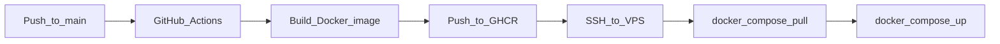

# Hướng dẫn Deploy lên VPS + CI/CD tự động

Tài liệu triển khai production cho URL Shortener với **Docker**, **Nginx**, **Let's Encrypt SSL**, và **GitHub Actions**.

> **Portfolio (Option A):** Infra (MongoDB, Redis, RabbitMQ) tách riêng khỏi app — mỗi dự án portfolio có stack riêng, không share data. Xem thêm [`deploy/PORTFOLIO.md`](deploy/PORTFOLIO.md).

## Kiến trúc Production

```
Internet
    │
    ▼
┌─────────────────────────────────────────┐
│  VPS (Ubuntu 22.04+)                    │
│  Nginx :443                             │
│    ├── yourdomain.com      → Frontend   │
│    ├── api.yourdomain.com  → Gateway    │
│    └── s.yourdomain.com    → Redirect   │
│                                         │
│  /opt/url-shortener/                    │
│    infra/  → MongoDB, Redis, RabbitMQ   │
│              (network: urlshortener-net)│
│    app/    → microservices + FE + nginx │
└─────────────────────────────────────────┘
```

| Subdomain | Service | Mục đích |
|-----------|---------|----------|
| `yourdomain.com` | Frontend | Dashboard, đăng nhập |
| `api.yourdomain.com` | API Gateway | REST API |
| `s.yourdomain.com` | Redirect | Short link `s.yourdomain.com/abc123` |

### Cấu trúc thư mục trên VPS

```
/opt/url-shortener/
├── .env
├── infra/
│   └── docker-compose.yml    # MongoDB, Redis, RabbitMQ
├── app/
│   └── docker-compose.yml    # 5 services + frontend + nginx
├── nginx/nginx.conf
├── certbot/
├── data/geoip/
├── infra-up.sh               # Khởi động infra (1 lần)
├── app-deploy.sh             # Deploy app (CI/CD chạy bước này)
└── deploy.sh                 # Infra + app
```

---

## Phần 1: Chuẩn bị VPS

### 1.1 Yêu cầu tối thiểu

| Resource | Khuyến nghị |
|----------|-------------|
| CPU | 2 vCPU |
| RAM | 4 GB |
| Disk | 40 GB SSD |
| OS | Ubuntu 22.04 LTS |

### 1.2 Trỏ DNS

Tạo A record trỏ về IP VPS:

```
yourdomain.com       → 1.2.3.4
api.yourdomain.com   → 1.2.3.4
s.yourdomain.com     → 1.2.3.4
```

### 1.3 Cài đặt Docker trên VPS

```bash
# SSH vào VPS
ssh root@1.2.3.4

# Cài Docker
curl -fsSL https://get.docker.com | sh
sudo usermod -aG docker $USER

# Cài Docker Compose plugin
sudo apt update && sudo apt install -y docker-compose-plugin

# Kiểm tra
docker --version
docker compose version
```

### 1.4 Tạo thư mục deploy

```bash
sudo mkdir -p /opt/url-shortener/{infra,app,nginx,certbot/conf,certbot/www,data/geoip}
sudo chown -R $USER:$USER /opt/url-shortener
```

### 1.5 Copy file cấu hình lên VPS

Từ máy local:

```bash
scp -r deploy/* user@1.2.3.4:/opt/url-shortener/
```

Hoặc clone repo backend:

```bash
cd /opt/url-shortener
git clone https://github.com/<username>/url-shortener-be.git .
cp deploy/.env.example .env
```

### 1.6 Cấu hình `.env` trên VPS

```bash
nano /opt/url-shortener/.env
```

```env
DOMAIN=yourdomain.com
API_URL=https://api.yourdomain.com
SHORT_URL_BASE=https://s.yourdomain.com
FRONTEND_URL=https://yourdomain.com

JWT_SECRET=<chạy: openssl rand -base64 48>
GHCR_OWNER=<github-username>
IMAGE_TAG=latest

MONGO_DB=urlshortener
RABBITMQ_USER=urlshortener
RABBITMQ_PASSWORD=<password-mạnh>
RABBITMQ_VHOST=urlshortener
```

### 1.7 Sửa Nginx config

```bash
nano /opt/url-shortener/nginx/nginx.conf
```

Thay tất cả `yourdomain.com` bằng domain thật của bạn.

### 1.8 SSL với Let's Encrypt (lần đầu)

```bash
cd /opt/url-shortener

# Tạm dừng nginx nếu đang chạy
docker compose -f app/docker-compose.yml stop nginx 2>/dev/null || true

# Lấy certificate (thay email và domain)
docker run -it --rm \
  -v "$(pwd)/certbot/conf:/etc/letsencrypt" \
  -v "$(pwd)/certbot/www:/var/www/certbot" \
  -p 80:80 \
  certbot/certbot certonly --standalone \
  --email your@email.com \
  --agree-tos \
  --no-eff-email \
  -d yourdomain.com \
  -d api.yourdomain.com \
  -d s.yourdomain.com
```

---

## Phần 2: Push Docker Images lên GitHub Container Registry

### 2.1 Đẩy code lên GitHub

```bash
# Repo backend
cd url-shortener-be
git init && git remote add origin git@github.com:<username>/url-shortener-be.git
git add . && git commit -m "Initial backend"
git push -u origin main

# Repo frontend
cd url-shortener-fe
git init && git remote add origin git@github.com:<username>/url-shortener-fe.git
git add . && git commit -m "Initial frontend"
git push -u origin main
```

### 2.2 Cho phép VPS pull image từ GHCR

Trên GitHub: **Settings → Packages** → đặt package visibility là **Public** (hoặc dùng PAT).

Trên VPS, login GHCR (nếu package private):

```bash
echo <GITHUB_PAT> | docker login ghcr.io -u <username> --password-stdin
```

### 2.3 Build image lần đầu (manual hoặc qua CI)

Push lên `main` → GitHub Actions tự build. Hoặc build local:

```bash
# Backend — từng service
docker build -f auth-service/Dockerfile -t ghcr.io/<user>/url-shortener-auth:latest .
docker push ghcr.io/<user>/url-shortener-auth:latest
# ... lặp cho url, redirect, analytics, gateway

# Frontend
cd url-shortener-fe
docker build \
  --build-arg NEXT_PUBLIC_API_URL=https://api.yourdomain.com \
  --build-arg NEXT_PUBLIC_SHORT_URL_BASE=https://s.yourdomain.com \
  -t ghcr.io/<user>/url-shortener-fe:latest .
docker push ghcr.io/<user>/url-shortener-fe:latest
```

### 2.4 Khởi động lần đầu trên VPS

```bash
cd /opt/url-shortener
chmod +x infra-up.sh app-deploy.sh deploy.sh

# Bước 1: Infra (MongoDB, Redis, RabbitMQ) — chạy 1 lần
./infra-up.sh

# Bước 2: App (kéo image + khởi động services)
docker compose -f app/docker-compose.yml pull
./app-deploy.sh

# Kiểm tra
docker compose -f infra/docker-compose.yml ps
docker compose -f app/docker-compose.yml ps
```

> **Lưu ý:** Infra không redeploy mỗi lần push code. CI/CD chỉ cập nhật `app/docker-compose.yml`.

---

## Phần 3: CI/CD tự động (GitHub Actions)

### 3.1 Luồng CI/CD



| Repo | Trigger | Hành động |
|------|---------|-----------|
| `url-shortener-be` | push `main` | Build 5 BE images → deploy lên VPS |
| `url-shortener-fe` | push `main` | Build FE image → deploy lên VPS |

Workflow files đã có sẵn:
- `url-shortener-be/.github/workflows/deploy.yml`
- `url-shortener-fe/.github/workflows/deploy.yml`

### 3.2 Cấu hình GitHub Secrets

Vào **GitHub repo → Settings → Secrets and variables → Actions**

**Secrets (cả 2 repo):**

| Secret | Ví dụ | Mô tả |
|--------|-------|-------|
| `VPS_HOST` | `1.2.3.4` | IP hoặc domain VPS |
| `VPS_USER` | `ubuntu` | User SSH |
| `VPS_SSH_KEY` | `-----BEGIN OPENSSH...` | Private key SSH |

**Variables (repo frontend):**

| Variable | Ví dụ |
|----------|-------|
| `API_URL` | `https://api.yourdomain.com` |
| `SHORT_URL_BASE` | `https://s.yourdomain.com` |

### 3.3 Tạo SSH key cho CI/CD

Trên máy local:

```bash
ssh-keygen -t ed25519 -C "github-actions" -f ~/.ssh/vps_deploy -N ""
```

```bash
# Copy public key lên VPS
ssh-copy-id -i ~/.ssh/vps_deploy.pub ubuntu@1.2.3.4

# Copy private key vào GitHub Secret VPS_SSH_KEY
cat ~/.ssh/vps_deploy
```

### 3.4 Kiểm tra CI/CD

```bash
# Sửa code → push
git add . && git commit -m "test deploy" && git push origin main
```

Vào **GitHub → Actions** tab xem workflow chạy. Sau ~5 phút:

```bash
# Trên VPS
docker compose -f /opt/url-shortener/app/docker-compose.yml ps
```

---

## Phần 4: Cập nhật CORS cho Production

Sửa `api-gateway` để cho phép domain production. File `application.yml`:

```yaml
# Thêm vào api-gateway hoặc dùng env SPRING_APPLICATION_JSON
```

Hoặc sửa `CorsConfig.java` thêm origin:

```java
config.setAllowedOrigins(List.of(
    "http://localhost:3000",
    "https://yourdomain.com"
));
```

Rebuild và deploy lại gateway.

---

## Phần 5: Vận hành

### Lệnh thường dùng

```bash
cd /opt/url-shortener

# Xem logs
docker compose -f app/docker-compose.yml logs -f api-gateway
docker compose -f app/docker-compose.yml logs -f redirect-service

# Restart 1 service
docker compose -f app/docker-compose.yml restart url-service

# Deploy thủ công (kéo image mới)
./app-deploy.sh

# Restart infra (hiếm khi cần)
docker compose -f infra/docker-compose.yml restart

# Backup MongoDB
docker exec urlshortener-mongodb mongodump --db urlshortener --out /data/db/backup
docker cp urlshortener-mongodb:/data/db/backup ./backup-$(date +%Y%m%d)
```

### Nhiều dự án portfolio trên cùng VPS

Mỗi dự án đặt trong `/opt/<tên-dự-án>/` với infra riêng:

| Dự án | Network | MongoDB container |
|-------|---------|-------------------|
| url-shortener | `urlshortener-net` | `urlshortener-mongodb` |
| blog-app (ví dụ) | `blog-net` | `blog-mongodb` |

Chi tiết: [`deploy/PORTFOLIO.md`](deploy/PORTFOLIO.md).

### Monitoring cơ bản

```bash
# Health check
curl https://api.yourdomain.com/actuator/health

# Test redirect
curl -I https://s.yourdomain.com/<shortCode>
```

### Firewall (UFW)

```bash
sudo ufw allow 22/tcp    # SSH
sudo ufw allow 80/tcp    # HTTP (Let's Encrypt)
sudo ufw allow 443/tcp   # HTTPS
sudo ufw enable
```

**Không mở** port 27017, 6379, 8080-8084 ra internet — chỉ Nginx public.

---

## Phần 6: Checklist trước go-live

- [ ] DNS A record trỏ đúng IP VPS
- [ ] SSL certificate hoạt động (https không báo lỗi)
- [ ] `.env` trên VPS có `JWT_SECRET` mạnh, không dùng default
- [ ] `SHORT_URL_BASE` = `https://s.yourdomain.com`
- [ ] `NEXT_PUBLIC_API_URL` build đúng trong FE image
- [ ] CORS gateway cho phép `https://yourdomain.com`
- [ ] GitHub Actions secrets đã cấu hình
- [ ] Test: đăng ký → tạo link → mở short link → xem analytics
- [ ] MongoDB backup schedule (cron weekly)

---

## Troubleshooting

| Vấn đề | Giải pháp |
|--------|-----------|
| CI/CD SSH failed | Kiểm tra `VPS_SSH_KEY`, firewall port 22 |
| `pull access denied` GHCR | `docker login ghcr.io` trên VPS hoặc set package public |
| FE gọi API lỗi CORS | Thêm domain vào `CorsConfig` gateway |
| Short link 502 | Kiểm tra `redirect-service` logs, `SHORT_URL_BASE` |
| SSL expired | Certbot container tự renew; kiểm tra `certbot renew` |
| Out of memory | Tăng RAM VPS hoặc giới hạn MongoDB cache |

---

## Tóm tắt nhanh

```bash
# 1. Setup VPS + Docker + DNS + SSL
# 2. Copy deploy/ lên /opt/url-shortener, sửa .env + nginx.conf
# 3. ./infra-up.sh          → MongoDB + Redis + RabbitMQ
# 4. Push code GitHub, cấu hình Secrets
# 5. ./app-deploy.sh        → hoặc push main → CI/CD tự deploy app
# 6. Truy cập https://yourdomain.com
```

Mỗi lần push code lên `main`, CI/CD chỉ build image mới và deploy **app** lên VPS (~5–10 phút). Infra giữ nguyên.
